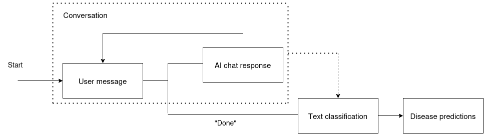

# AI Doctor

A chat bot that tries to diagnose your disease given symptoms. Recognizes 24 diseases (or no disease). 

The AI doctor consists of two main components: a chat bot that asks questions about symptoms and a disease classifier that predicts the disease based on the conversation.

The base model of the chat bot is a light-weight transformer Qwen2-0.5B-Instruct [1] fined-tuned on a [dataset of synthetic conversations between patients and doctors](https://www.kaggle.com/datasets/niyarrbarman/symptom2disease/code). The text classifier is a BERT model [2] fine-tuned on the same dataset. After the patient is done with the conversation, the whole conversation is passed to the classifier to make the final prediction about the disease. The pipeline is illustrated in Figure 1.

*Figure 1. Doctor AI pipeline.*

Model strenghts:

- The chat bot speaks fluently in a human-like manner.
- The chat bot asks relevant questions from the patient when the patient has medical conditions similar to the training data.

Model limitations:
- Only recognizes 24 diseases.
- If the patient has a disease other than the chat bot expected based on the first user input, the bot usually gets stuck to the first anticipated disease and does not ask relevant questions anymore.

Improvement ideas:
- Add a database of diseases and symptoms that the chat bot can leverage through retrieval-augmented generation (RAG).
- Combine the chat bot and the classifier into a single module that can be trained end-to-end.

## References

[1] Yang et al. Qwen technical report. 2024. https://arxiv.org/abs/2407.10671.

[2] Devlin et al. BERT: Pre-training of Deep Bidirectional Transformers for Language Understanding. 2018. https://arxiv.org/abs/1810.04805.